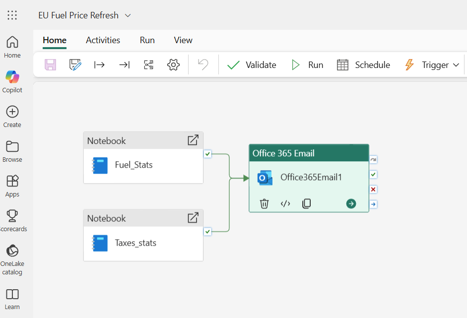
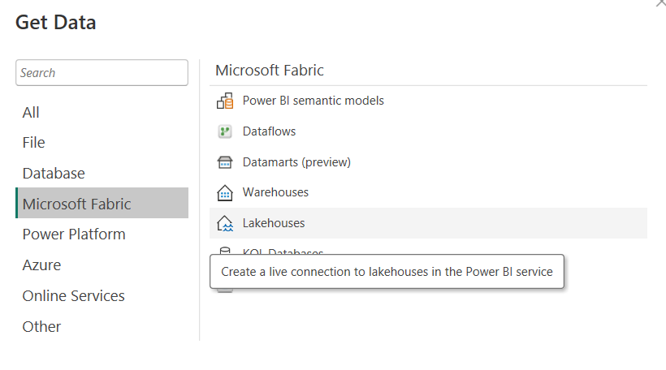

# EU Fuel Prices Analysis Dashboard

*A Power BI dashboard analyzing fuel prices (Euro-Super 95 and Diesel) across European Union countries, with tax breakdowns, historical trends since 2005, and geopolitical impact visualization. Built with Microsoft Fabric for automated weekly data updates from the European Commission.*

---

## 📌 Project Overview

This project provides a **comprehensive analysis** of fuel prices across the European Union, focusing on:
- **Price comparisons** between EU countries for Euro-Super 95 and Diesel
- **Tax breakdowns** (VAT, excise duties, other taxes)
- **Historical trends** since 2005
- **Geopolitical impact** visualization (Ukraine war, Hormuz Strait blockade)
- **Weekly automated data updates**

The solution leverages **Microsoft Fabric** for data ingestion, transformation, and storage, with **Power BI** for visualization and dashboard creation.

---

## 📊 Power BI Dashboard Pages

### **Page 1: EU Petrol Prices - Euro-Super 95**
- **Filled Map** showing Euro-Super 95 price differences across EU countries
- **Top 5 most expensive** and **top 5 cheapest** countries (price in €/liter)
- **Historical trend** of average Euro-Super 95 price in EU since 2005 (with historical context tooltips)
- **Current average Euro-Super 95 price** in EU (price in €/liter)
- **1-year evolution** of Euro-Super 95 prices (price in €/liter)


*Example screenshot of SP95 prices page*

---

### **Page 2: EU Diesel Prices**
- **Filled Map** showing Diesel price differences across EU countries (price in €/liter)
- **Top 5 most expensive** and **top 5 cheapest** countries (price in €/liter)
- **Historical trend** of average Diesel price in EU since 2005 (with historical context tooltips)
- **Current average Diesel price** in EU (price in €/liter)
- **1-year evolution** of Diesel prices (price in €/liter)


*Example screenshot of Diesel prices page*

---
### **Page 3: EU Fuel Taxes**
- **Filled Map** showing VAT differences across EU countries
- **Top 5 highest VAT** and **top 5 lowest VAT** countries
- **Table** displaying excise duties and other taxes for Euro-Super 95 and Diesel (price in €/liter)


*Example screenshot of fuel taxes page*

---
### **Page 4: Country View**
- **Dropdown menu** to select any EU country
- **Card** showing the selected country's VAT rate
- **Azure Map** of the selected country
- **Data cards** showing Euro-Super 95 and Diesel prices for the selected country


*Example screenshot of country view page*

---
### **Page 5: Overall Ranking**
- **Complete ranking** of EU countries by Euro-Super 95 price (€/liter)
- **Complete ranking** of EU countries by Diesel price (€/liter)
- **Complete ranking** of EU countries by fuel VAT rate


*Example screenshot of overall ranking page*

[To view the complete ranking directly, you can click here](#-overall-ranking---june-1st-2026)

---

## ⚙️ Technical Implementation

The project was developed entirely in **Microsoft Fabric** and **Power BI** (no VS Code used). Here's the technical architecture:

### **Data Pipeline**
1. **Python Notebooks** in Microsoft Fabric:
   - `EU_Fuel_Price_ETL.ipynb` - Extracts and cleans Euro-Super 95 and Diesel prices data
   - `Taxes.ipynb` - Extracts Taxes data

2. **Data Processing**:
   - Both scripts clean and transform the data
   - Data is loaded into **LakeHouse tables** in Microsoft Fabric

3. **Automation**:
   - **Weekly pipeline** that automatically runs both Python scripts
   - **Email notifications** sent upon successful completion

   

4. **Visualization**:

   - Power BI dashboard connected directly to Lakehouse tables

   

   - Published to **Power BI Service** (visible in Microsoft Fabric workspace)

### **Data Source**
- Weekly updates from the [European Commission's Weekly Oil Bulletin](https://energy.ec.europa.eu/data-and-analysis/weekly-oil-bulletin_en)

---

## 🔍 Key Insights (as of June 1, 2026)

### 💰 Fuel Price Composition in the EU

Understanding the price composition is essential to interpret the data correctly. In the European Union, fuel prices are composed of four main elements:

1. **Product Cost** (crude oil price, refining, transport)
2. **Distribution Margins** (storage, logistics, service station operations)
3. **Excise Duties and Other Taxes** (specific taxes per liter, sometimes including environmental taxes)
4. **VAT** (applied to the tax-exclusive price, often including excise duties)

### **Main Insights**

#### **1. Geopolitical Impact**
The dashboard clearly visualizes the impact of:
- **Ukraine war** (since 2022) on fuel prices across the EU
- **Hormuz Strait blockade** (since March 2026) on recent price increases

#### **2. Price Disparities Between EU Countries**

**Euro-Super 95 Prices (€/liter):**
| Rank | Country | Price |
|------|---------|-------|
| **Most Expensive** | Denmark | €2.39 |
| | Netherlands | €2.30 |
| | Finland | €2.20 |
| | Greece | €2.06 |
| | France | €2.06 |
| **Cheapest** | Malta | €1.34 |
| | Poland | €1.42 |
| | Bulgaria | €1.53 |
| | Spain | €1.55 |
| | Cyprus | €1.61 |

**Diesel Prices (€/liter):**
| Rank | Country | Price |
|------|---------|-------|
| **Most Expensive** | Finland | €2.30 |
| | Netherlands | €2.16 |
| | Denmark | €2.11 |
| | Belgium | €2.08 |
| | France | €2.04 |
| **Cheapest** | Malta | €1.21 |
| | Poland | €1.47 |
| | Czech Republic | €1.58 |
| | Slovakia | €1.65 |
| | Spain | €1.65 |

**Key Observations:**
- **Malta** has the cheapest fuel prices in the EU
- **Average EU Euro-Super 95 price**: €1.85/liter (up €0.25 from 1 year ago)
- **Average EU Diesel price**: €1.84/liter (up €0.36 from 1 year ago)
- **Finland** saw the largest increases in both Euro-super 95 (+€0.52/liter) and diesel (+€0.72/liter) prices over the past year.

#### **3. VAT and Tax Disparities**

**VAT Rates:**
| Rank | Country | VAT Rate |
|------|---------|----------|
| **Highest VAT** | Hungary | 27% |
| | Finland | 25.5% |
| | Croatia, Denmark, Sweden | 25% |
| **Lowest VAT** | Poland | 8% |
| | Spain | 10% |
| | Luxembourg | 17% |
| | Malta | 18% |
| | Cyprus, Germany | 19% |

**Interesting Case - Hungary:**
Despite having the **highest VAT (27%)**, Hungary shows relatively **reasonable fuel prices** (Euro-Super 95: €1.69/liter, Diesel: €1.75/liter) compared to other EU countries. **The reasons for this particular case need to be investigated.**

---

## 📁 Project Structure

```bash
EU_Fuel_Prices/
├── notebooks/             # Python notebooks for data extraction
│   ├── EU_Fuel_Price_ETL
│   └── Taxes
├── screenshots/
│   └── power_bi/           # Power BI dashboard screenshots
│   └── fabric/            # Microsoft Fabric screenshots
└── README.md

```

---

## 🏆 Overall Ranking - June 1st, 2026


### ⛽ EU Petrol Euro-Super 95 Prices (€/L)

| Rank | Country         | Price |
|------|-----------------|-------|
| 1    | Denmark         | 2.39 € |
| 2    | Netherlands     | 2.30 € |
| 3    | Finland         | 2.20 € |
| 4    | Greece          | 2.06 € |
| 5    | France          | 2.06 € |
| 6    | Germany         | 1.96 € |
| 7    | Portugal        | 1.94 € |
| 8    | Italy           | 1.95 € |
| 9    | Belgium         | 1.85 € |
| 10   | Latvia          | 1.88 € |
| 11   | Ireland         | 1.84 € |
| 12   | Romania         | 1.84 € |
| 13   | Estonia         | 1.81 € |
| 14   | Lithuania       | 1.79 € |
| 15   | Slovakia        | 1.74 € |
| 16   | Austria         | 1.74 € |
| 17   | Slovenia        | 1.72 € |
| 18   | Czech Republic  | 1.72 € |
| 19   | Luxembourg      | 1.70 € |
| 20   | Croatia         | 1.70 € |
| 21   | Hungary         | 1.69 € |
| 22   | Sweden          | 1.61 € |
| 23   | Cyprus          | 1.61 € |
| 24   | Spain           | 1.55 € |
| 25   | Bulgaria        | 1.53 € |
| 26   | Poland          | 1.42 € |
| 27   | Malta           | 1.34 € |


### 🚗 EU Diesel Prices (€/L)

| Rank | Country         | Price |
|------|-----------------|-------|
| 1    | Finland         | 2.30 € |
| 2    | Netherlands     | 2.16 € |
| 3    | Denmark         | 2.11 € |
| 4    | Belgium         | 2.08 € |
| 5    | France          | 2.04 € |
| 6    | Italy           | 2.02 € |
| 7    | Ireland         | 1.92 € |
| 8    | Lithuania       | 1.88 € |
| 9    | Portugal        | 1.87 € |
| 10   | Germany         | 1.86 € |
| 11   | Austria         | 1.83 € |
| 12   | Latvia          | 1.82 € |
| 13   | Sweden          | 1.82 € |
| 14   | Romania         | 1.80 € |
| 15   | Estonia         | 1.80 € |
| 16   | Cyprus          | 1.80 € |
| 17   | Croatia         | 1.79 € |
| 18   | Slovenia        | 1.76 € |
| 19   | Hungary         | 1.75 € |
| 20   | Greece          | 1.74 € |
| 21   | Luxembourg      | 1.73 € |
| 22   | Bulgaria        | 1.71 € |
| 23   | Spain           | 1.65 € |
| 24   | Czech Republic  | 1.58 € |
| 25   | Slovakia        | 1.65 € |
| 26   | Poland          | 1.47 € |
| 27   | Malta           | 1.21 € |


### 🧾 EU VAT Rates

| Rank | Country         | VAT Rate |
|------|-----------------|----------|
| 1    | Hungary         | 27.0% |
| 2    | Finland         | 25.5% |
| 3    | Croatia         | 25.0% |
| 4    | Denmark         | 25.0% |
| 5    | Sweden          | 25.0% |
| 6    | Greece          | 24.0% |
| 7    | Ireland         | 23.0% |
| 8    | Portugal        | 23.0% |
| 9    | Slovakia        | 23.0% |
| 10   | Estonia         | 22.0% |
| 11   | Italy           | 22.0% |
| 12   | Slovenia        | 22.0% |
| 13   | Belgium         | 21.0% |
| 14   | Czech Republic  | 21.0% |
| 15   | Latvia          | 21.0% |
| 16   | Lithuania       | 21.0% |
| 17   | Netherlands     | 21.0% |
| 18   | Romania         | 21.0% |
| 19   | Austria         | 20.0% |
| 20   | Bulgaria        | 20.0% |
| 21   | France          | 20.0% |
| 22   | Cyprus          | 19.0% |
| 23   | Germany         | 19.0% |
| 24   | Malta           | 18.0% |
| 25   | Luxembourg      | 17.0% |
| 26   | Spain           | 10.0% |
| 27   | Poland          | 8.0% |
